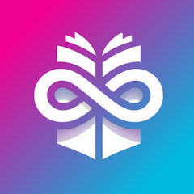
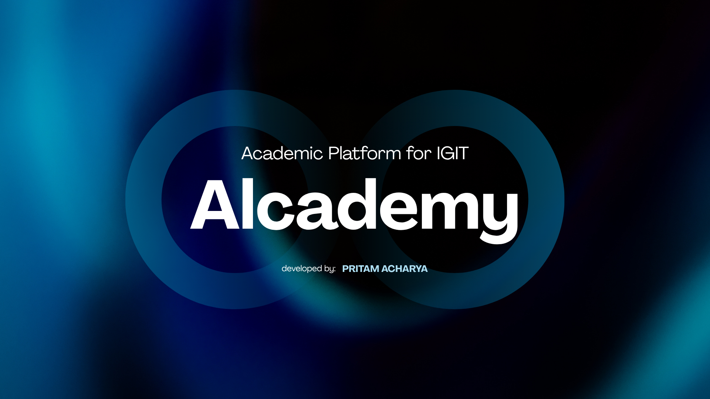
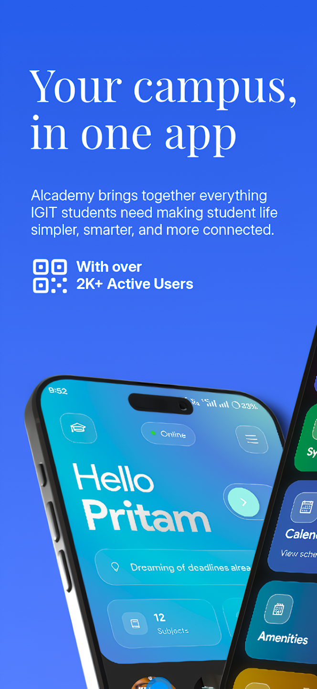
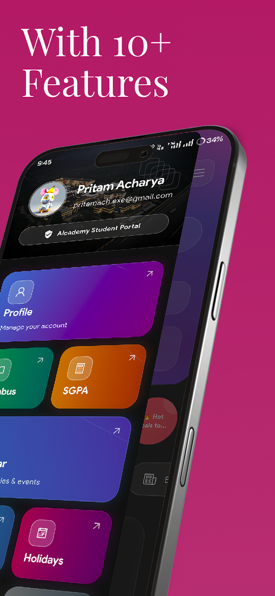
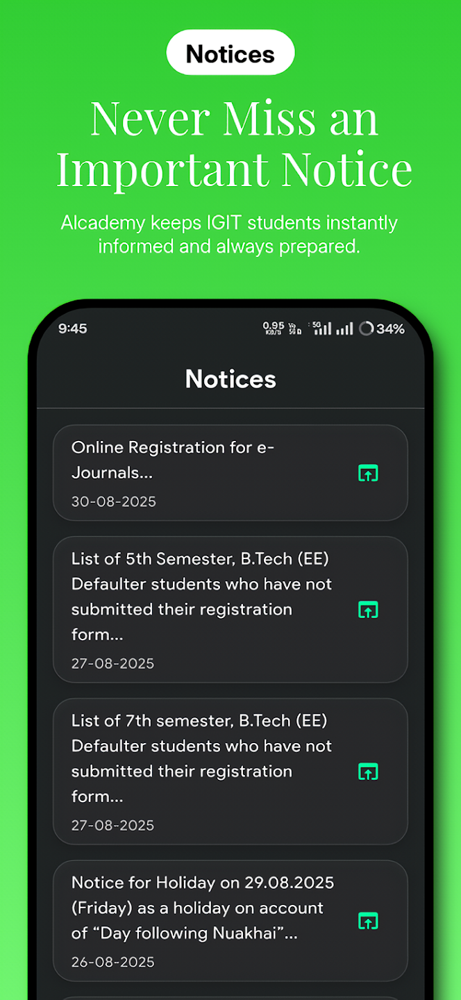
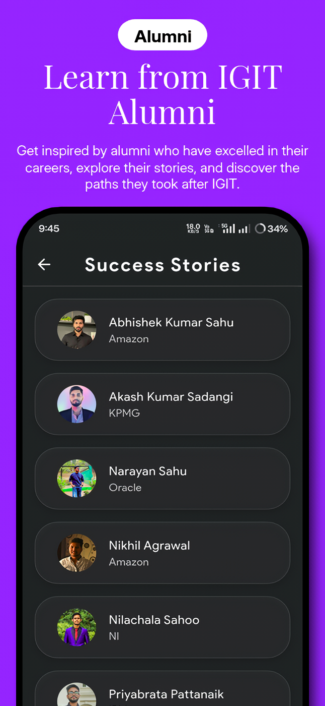
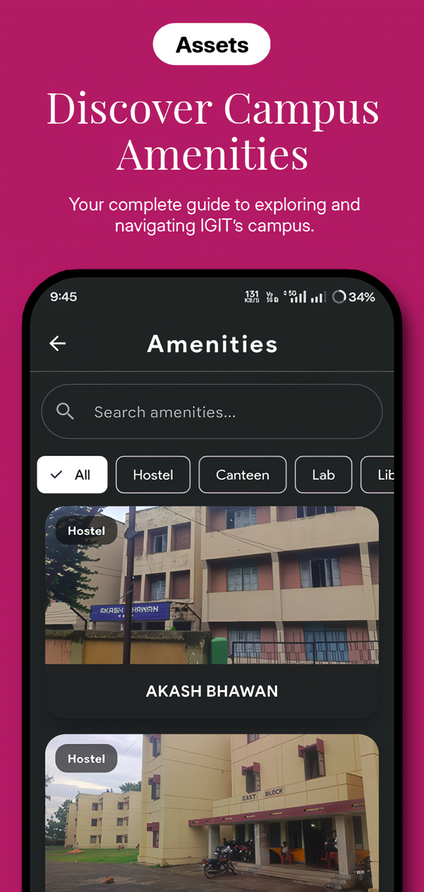

<h1 align="center">
  
  Alcademy – Academic Platform for IGIT
</h1>

<p align="center">
  
</p>

<p align="center">
  <a href="https://play.google.com/store/apps/details?id=com.alcademy.app">
    
  </a>
  <a href="https://aca-web-c0e77.web.app/">
    
  </a>
</p>

<p align="center">
  
  
  
</p>

<p align="center">
  
  
  
  
</p>

<p align="center">
  <b>A production-scale academic platform used daily by 2000+ students, built under real-world constraints.</b>
</p>

---

## 🧭 What This Project Actually Is

Alcademy is a **client-orchestrated academic ecosystem** designed for:

* Fragmented institutional systems
* Unreliable data sources
* Strict API rate limits

> Instead of centralizing everything, responsibilities are **distributed across systems**, with the **Flutter client acting as the orchestration layer**.

---

## 🧠 Why This Project Stands Out

| Area                | What Makes It Different                       |
| ------------------- | --------------------------------------------- |
| Architecture     | Client-driven orchestration (non-traditional) |
| Reliability      | Works even when some sources fail             |
| Performance      | Heavy use of caching + isolates               |
| Scalability      | No single system bottleneck                   |
| Real-world usage | 2000+ active users                            |

---


<p align="center">
  <a href="https://youtu.be/0wLjJ-lTiVA?si=AFd6rg-Yp7NX1h9b">
    
  </a>
</p>

---


<p align="center">
  
  
  
  
  
</p>

---

## 🧱 Architecture Diagram

```
                         ┌──────────────────────────┐
                         │     External Systems     │
                         │──────────────────────────│
                         │  • Google Gemini API     │
                         │  • GitHub API (Notes)    │
                         │  • College Websites      │
                         │    (Scraped Data)        │
                         └──────────┬───────────────┘
                                    │
                                    ▼
                        ┌──────────────────────────┐
                        │     Flutter Client       │
                        │──────────────────────────│
                        │ • Feature Modules        │
                        │ • API Orchestration      │
                        │ • Caching Layer          │
                        │ • Rate Limiting          │
                        │ • Deep Linking           │
                        │ • Isolates (Parsing)     │
                        └───────┬────────┬─────────┘
                                │        │
               ┌────────────────┘        └────────────────┐
               ▼                                         ▼
   ┌──────────────────────┐               ┌────────────────────────┐
   │     Supabase         │               │       Firebase         │
   │──────────────────────│               │────────────────────────│
   │ • Users              │               │ • Push Notifications   │
   │ • Posts (Threads)    │               │   (FCM only)           │
   │ • Clubs Data         │               └────────────────────────┘
   │ • Storage (Buckets)  │
   └──────────────────────┘

               ▼
   ┌──────────────────────────────┐
   │   Local Device Layer 🔐      │
   │──────────────────────────────│
   │ • Secure Vault (Biometric)   │
   │ • Cached API Responses       │
   │ • Offline Utilities          │
   └──────────────────────────────┘
```

---

## ⚙️ System Design Philosophy

### Why this architecture works

* **Decoupled systems** → failure in one source doesn’t break the app
* **Client-side intelligence** → reduces backend complexity
* **GitHub as CDN** → predictable scaling
* **Local-first design** → fast UX + offline support

> 🧠 “Move complexity to where it scales best — in this case, the client.”

---

## 🔄 Data Flow Pipeline

```
Google Drive → Python Script → GitHub → Flutter App
```

### Pipeline Breakdown

| Step             | Purpose                   |
| ---------------- | ------------------------- |
| Google Drive  | Easy content management   |
| Python Script | Structured transformation |
| GitHub        | CDN layer                 |
| Flutter       | Smart consumption         |

---

## 🧩 Core Systems

### 📚 Academic Resource Engine

* GitHub-backed structured content
* Locally cached
* High-read optimized

---

### 🧵 IGIT Threads

* Supabase-powered discussions
* Deep linking enabled
* Club-managed communities

---

### 🔔 Notification System

* Firebase FCM (delivery only)
* Event-triggered

---

### 🧠 AI Assistant

* Gemini API integration
* Stateless architecture
* Low latency

---

### 📰 Notices Engine

* Web scraping pipeline
* Parsed via isolates
* Fault-tolerant

---

### 🛡 Secure Vault

* Biometric-protected
* Local-only storage
* No backend dependency

---

## ⚡ Performance Engineering

### Key Optimizations

* Smart API caching
* Rate limiting (**60/hr + controlled refresh**)
* Background parsing (isolates)
* Lazy loading

### Result

* **41 min avg engagement**
* Smooth UI under heavy load
* Reduced API failures

---

## 🌐 Scalability Strategy

| Layer       | Strategy           |
| ----------- | ------------------ |
| 🌐 GitHub   | Static scaling     |
| 🧩 Supabase | Relational scaling |
| 🧠 Client   | Orchestration      |

> No single system becomes a bottleneck.

---

## 💠 Key Engineering Wins

* Resilient multi-source system
* Reduced backend dependency
* Designed for unreliable environments
* High engagement via performance tuning

---

## 🔰 What You Can Learn

* Client-side system design
* API orchestration
* Flutter performance patterns
* Caching + rate limiting
* Building under constraints

---

## 🛠 Tech Stack

| Layer            | Tech                           |
| ---------------- | ------------------------------ |
| Mobile        | Flutter (Dart)                 |
| Backend       | Supabase                       |
| Notifications | Firebase FCM                   |
| Content       | GitHub API                     |
| AI            | Google Gemini API              |
| Local         | SharedPreferences + Biometrics |

---

## ☢️ Trade-offs 

| Decision              | Reason                     |
| --------------------- | -------------------------- |
| Client-heavy logic | Reduced backend complexity |
| GitHub as CDN      | Free + scalable            |
| Stateless AI        | Faster responses           |
| Scraping notices   | No official APIs           |

---

## 🌀 Highlights

* Fast (offline-first + caching)
* Smart (AI + orchestration)
* Secure (biometric vault)
* Resilient (multi-source fallback)

---

## 🛠 Run Locally

```bash
git clone https://github.com/your-repo
cd your-repo
flutter pub get
flutter run
```

---

## 🤝 Contributing

Currently not open for external contributions.

---

## 📌 Closing

Alcademy is a **system design project disguised as a mobile app**.

Built with one goal:

> 🪐 Deliver fast, reliable academic access even in imperfect environments.
