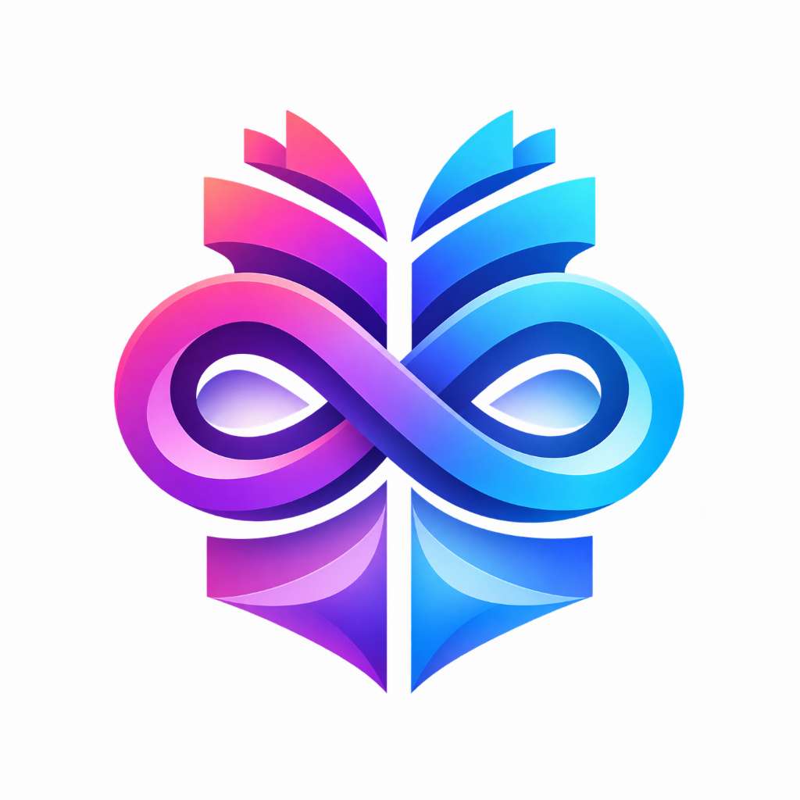
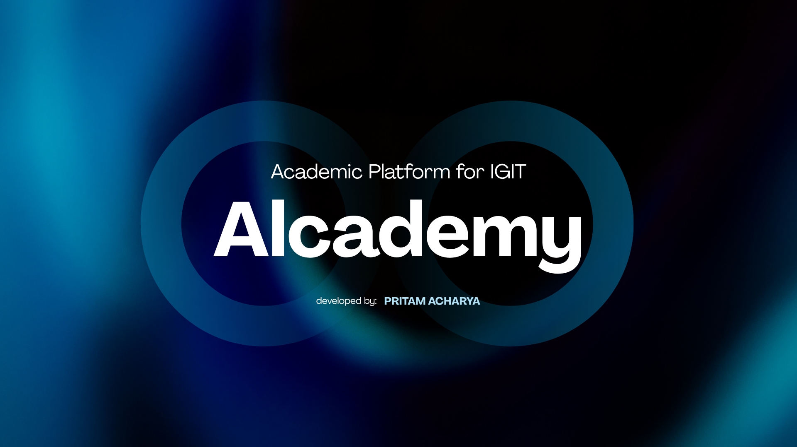
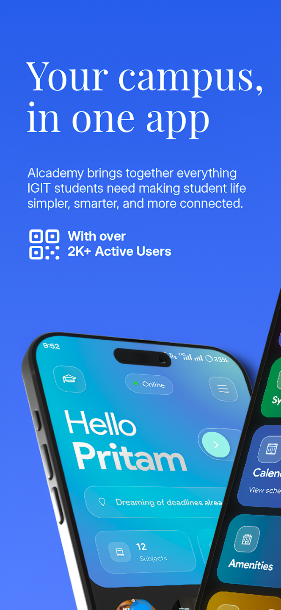
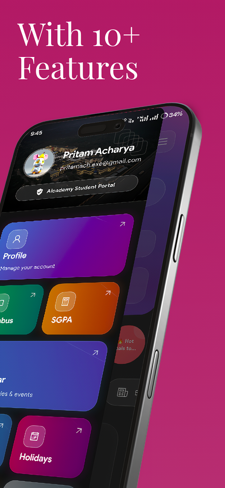
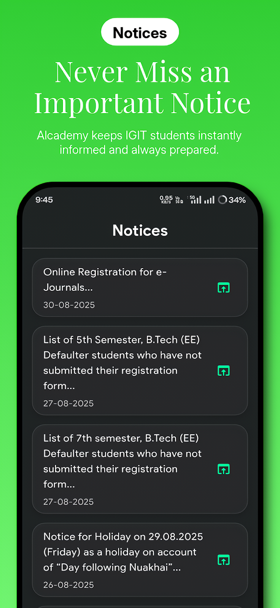
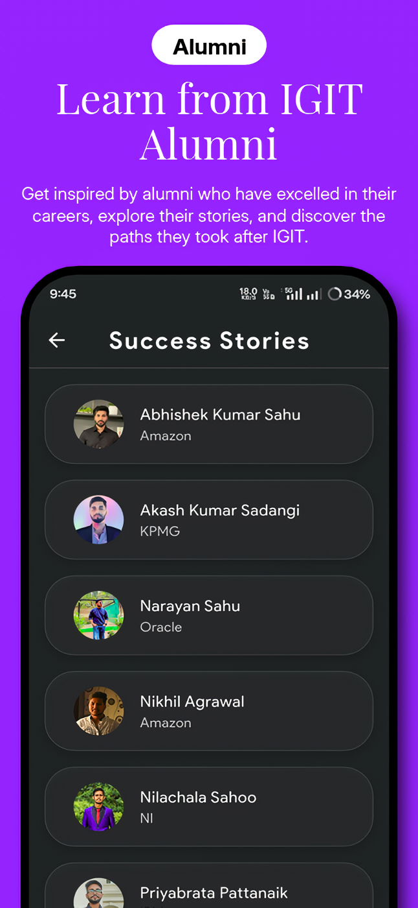

<p align="center">
  
</p>

<h1 align="center">Alcademy</h1>

<p align="center">Academic resources and campus information for students at IGIT Sarang.</p>

<p align="center">
  <a href="https://play.google.com/store/apps/details?id=com.alcademy.app">Download on Google Play</a>
  &nbsp;·&nbsp;
  <a href="https://aca-web-c0e77.web.app/">Website</a>
</p>

<p align="center">
  
</p>

Alcademy brings notes, college notices, ERP records, and everyday student tools into one Flutter app. Used by more than 2,000 students, it combines a dark interface with cached content and direct access to the college's existing systems.

## Inside the app

| Area | Features |
| --- | --- |
| Academics | Branch and semester notes, syllabus, SGPA calculator, and a shared PDF viewer |
| Student records | ERP-backed results, timetable, attendance, fees, and holidays |
| Campus | College notices, amenities, academic documents, and notification history |
| Reading | Blogs, alumni success stories, and Beyond campus stories with daily news |
| Personal tools | Expense tracking and a local Private Space for notes and media |
| Profile | Saved ERP credentials and separate notice/general notification preferences |

<p align="center">
  <a href="https://youtu.be/0wLjJ-lTiVA?si=AFd6rg-Yp7NX1h9b">
    
  </a>
</p>

<p align="center">
  
  
  
  
</p>

## System architecture


The app uses three distinct data paths:

- **Student records:** a WebView shares the ERP cookie session, signs in with locally saved credentials when needed, and extracts records for native Flutter screens. Scheduled jobs do not access student credentials.
- **Shared content:** repositories read notes and JSON feeds from GitHub. Source locations are centralized in [`GitHubSources`](lib/core/network/github_sources.dart), while each feature handles its own parsing and cache policy.
- **Notifications and generated feeds:** Python jobs run through GitHub Actions. They monitor notices, publish daily news and festival data, and use Firebase Cloud Messaging for notice delivery.

Feature code lives in `lib/features/`, with presentation, data, and model layers where needed. Shared networking, configuration, and storage live in `lib/core/`; reusable UI, theme, and PDF components live in `lib/shared/`.

## Refresh and storage

Caches reduce repeated requests; they are not a replacement for the underlying college services. An uncached ERP record still requires a working connection and valid credentials.

| Data | Refresh policy |
| --- | --- |
| ERP attendance | Expires at the next 9:00 AM boundary in device local time |
| ERP timetable, results, fees, and holidays | Calendar-month cache; pull to refresh requests an update |
| Blogs and success stories | Calendar-month cache with a valid stale snapshot available offline |
| Daily news | Expires at the next 10:00 AM IST boundary |
| Festival calendar | Calendar-month cache; today's greeting is evaluated separately |
| PDF documents | Disk cache configured for 20 documents and a seven-day stale period |

ERP credentials use secure platform storage. Private Space files stay on the device and can be protected by biometric access; they are **not an encrypted vault**. Network images use the app's image caching components rather than being embedded in the news feed JSON.

## Scheduled jobs

| Workflow | Schedule | Purpose |
| --- | --- | --- |
| [`notice-checker.yml`](.github/workflows/notice-checker.yml) | Every ten minutes, offset from the hour | Detect new college notices and send a grouped notification |
| [`daily-stories.yml`](.github/workflows/daily-stories.yml) | Daily at 7:43 AM IST | Publish the daily news feed to the `daily-stories` branch |
| [`festivals.yml`](.github/workflows/festivals.yml) | First day of each month at 5:47 AM IST | Publish current- and next-year festival records to the `festivals` branch |

GitHub may delay scheduled runs. The notice checker keeps its state on the `notification-state` branch, has separate test and production audiences, and requires explicit repository configuration before scheduled production delivery. Firebase service-account credentials belong in repository secrets, never in app assets.

Setup and operational details: [notice checker](backend/notice_checker/README.md), [daily stories](backend/daily_stories/README.md), and [festival calendar](backend/festivals/README.md).

## Repository layout

```text
lib/
  app/          App setup and routing
  core/         Configuration, networking, and cache infrastructure
  features/     Screens, repositories, parsers, and models
  shared/       Theme, reusable widgets, and PDF viewer
content/        Notes, article feeds, settings, and content images
backend/        Scheduled Python jobs and their tests
assets/         Bundled images, fonts, and fallback data
test/          Dart unit, widget, and golden tests
third_party/    Vendored plugin compatibility patches
```

Blogs and success stories are single JSON feeds whose bodies retain Markdown formatting. To change content sources, edit `lib/core/network/github_sources.dart`. The `content/Notes/` directory retains its existing branch and semester files.

## Development

The project requires **Flutter 3.47 or newer** and **Dart 3.12 or newer**, as declared in `pubspec.yaml`. Android development also requires the Android SDK and a compatible JDK. iOS development requires macOS, Xcode, and CocoaPods.

```bash
git clone https://github.com/IamPritamAcharya/Alcademy.git
cd Alcademy
flutter pub get
flutter run
```

For a device subscribed to the test notice audience:

```bash
flutter run --dart-define=NOTICE_PUSH_TEST=true
```

Run static analysis and tests:

```bash
flutter analyze
flutter test
```

### Release builds

Android APK:

```bash
flutter build apk --release --dart-define=NOTICE_PUSH_PRODUCTION=true
```

Google Play bundle:

```bash
flutter build appbundle --release --dart-define=NOTICE_PUSH_PRODUCTION=true
```

For iOS, install pods and open the Xcode workspace:

```bash
cd ios
pod install --repo-update
cd ..
open ios/Runner.xcworkspace
```

Select your Apple Developer team in Runner's signing settings. The Firebase iOS configuration must match `com.alcademy.app`; push delivery also requires an APNs key configured in Firebase. After signing and testing on an iPhone:

```bash
flutter build ipa --release --dart-define=NOTICE_PUSH_PRODUCTION=true
```

The production flag selects the notice topic subscription. It does not send notifications. Android is the established release target; the iOS configuration is prepared but still needs native build and device verification.

## Contributions

Only resource contributions are currently open, including notes and study materials. Code contributions are not open. Notes contributor credits are maintained in the app's content settings.
